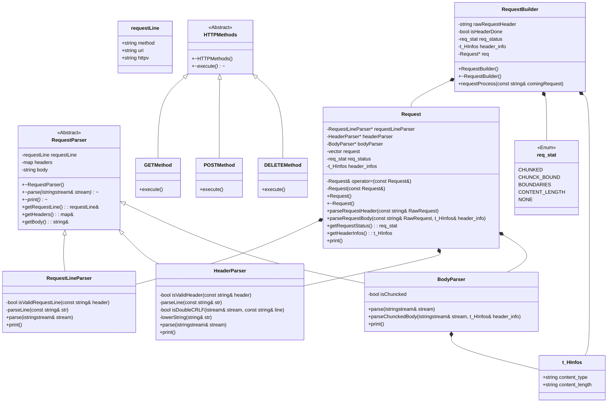

```mermaid
classDiagram
    class requestLine {
        +string method
        +string uri
        +string httpv
    }

    class RequestParser {
        <<Abstract>>
        -requestLine requestLine
        -map<string, string> headers
        -string body
        +~RequestParser()
        +~parse(istringstream& stream)~*
        +~print()~*
        +getRequestLine() : requestLine&
        +getHeaders() : map<string, string>&
        +getBody() : string&
    }

    class RequestBuilder {
        -string rawRequestHeader
        -bool isHeaderDone
        -req_stat req_status
        -t_HInfos header_info
        -Request* req
        +RequestBuilder()
        +~RequestBuilder()
        +requestProcess(const string& comingRequest)
    }

    class Request {
        -RequestLineParser* requestLineParser
        -HeaderParser* headerParser
        -BodyParser* bodyParser
        -vector<RequestParser*> request
        -req_stat req_status
        -t_HInfos header_infos
        -Request& operator=(const Request&)
        -Request(const Request&)
        +Request()
        +~Request()
        +parseRequestHeader(const string& RawRequest)
        +parseRequestBody(const string& RawRequest, t_HInfos& header_info)
        +getRequestStatus() : req_stat
        +getHeaderInfos() : t_HInfos
        +print()
    }

    class HTTPMethods {
        <<Abstract>>
        +~HTTPMethods()
        +~execute()~*
    }

    class GETMethod {
        +execute()
    }

    class POSTMethod {
        +execute()
    }

    class DELETEMethod {
        +execute()
    }

    class RequestLineParser {
        -bool isValidRequestLine(const string& header)
        -parseLine(const string& str)
        +parse(istringstream& stream)
        +print()
    }

    class HeaderParser {
        -bool isValidHeader(const string& header)
        -parseLine(const string& str)
        -bool isDoubleCRLF(istream& stream, const string& line)
        -lowerString(string& str)
        +parse(istringstream& stream)
        +print()
    }

    class BodyParser {
        -bool isChuncked
        +parse(istringstream& stream)
        +parseChunckedBody(istringstream& stream, t_HInfos& header_info)
        +print()
    }

    class t_HInfos {
        +string content_type
        +string content_length
    }

    class req_stat {
        <<Enum>>
        CHUNKED
        CHUNCK_BOUND
        BOUNDARIES
        CONTENT_LENGTH
        NONE
    }

    RequestParser <|-- RequestLineParser
    RequestParser <|-- HeaderParser
    RequestParser <|-- BodyParser
    HTTPMethods <|-- GETMethod
    HTTPMethods <|-- POSTMethod
    HTTPMethods <|-- DELETEMethod
    Request *-- RequestLineParser
    Request *-- HeaderParser
    Request *-- BodyParser
    RequestBuilder *-- Request
    RequestBuilder *-- req_stat
    RequestBuilder *-- t_HInfos
    BodyParser *-- t_HInfos

```