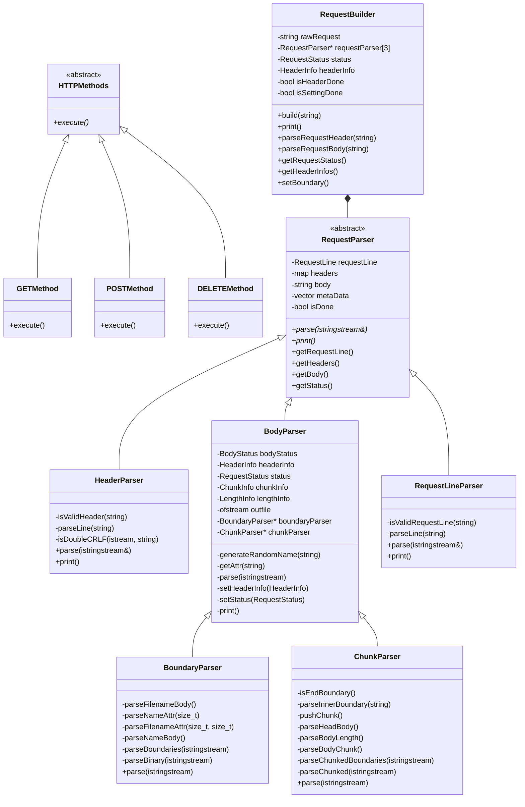

# Request Diagram

```mermaid

classDiagram
    class HTTPMethods {
        <<abstract>>
        +execute()*
    }

    class GETMethod {
        +execute()
    }

    class POSTMethod {
        +execute()
    }

    class DELETEMethod {
        +execute()
    }

    class RequestParser {
        <<abstract>>
        -RequestLine requestLine
        -map headers
        -string body
        -vector metaData
        -bool isDone
        +parse(istringstream&)*
        +print()*
        +getRequestLine()
        +getHeaders()
        +getBody()
        +getStatus()
    }

    class RequestBuilder {
        -string rawRequest
        -RequestParser* requestParser[3]
        -RequestStatus status
        -HeaderInfo headerInfo
        -bool isHeaderDone
        -bool isSettingDone
        +build(string)
        +print()
        +parseRequestHeader(string)
        +parseRequestBody(string)
        +getRequestStatus()
        +getHeaderInfos()
        +setBoundary()
    }

    class HeaderParser {
        -isValidHeader(string)
        -parseLine(string)
        -isDoubleCRLF(istream, string)
        +parse(istringstream&)
        +print()
    }

    class BodyParser {
        -BodyStatus bodyStatus
        -HeaderInfo headerInfo
        -RequestStatus status
        -ChunkInfo chunkInfo
        -LengthInfo lengthInfo
        -ofstream outfile
        -BoundaryParser* boundaryParser
        -ChunkParser* chunkParser
        -generateRandomName(string)
        -getAttr(string)
        -parse(istringstream)
        -setHeaderInfo(HeaderInfo)
        -setStatus(RequestStatus)
        -print()
    }

    class BoundaryParser {
        -parseFilenameBody()
        -parseNameAttr(size_t)
        -parseFilenameAttr(size_t, size_t)
        -parseNameBody()
        -parseBoundaries(istringstream)
        -parseBinary(istringstream)
        +parse(istringstream)
    }

    class ChunkParser {
        -isEndBoundary()
        -parseInnerBoundary(string)
        -pushChunk()
        -parseHeadBody()
        -parseBodyLength()
        -parseBodyChunk()
        -parseChunkedBoundaries(istringstream)
        -parseChunked(istringstream)
        +parse(istringstream)
    }

    class RequestLineParser {
        -isValidRequestLine(string)
        -parseLine(string)
        +parse(istringstream&)
        +print()
    }

    HTTPMethods <|-- GETMethod
    HTTPMethods <|-- POSTMethod
    HTTPMethods <|-- DELETEMethod

    RequestParser <|-- HeaderParser
    RequestParser <|-- BodyParser
    RequestParser <|-- RequestLineParser

    BodyParser <|-- BoundaryParser
    BodyParser <|-- ChunkParser

    RequestBuilder *-- RequestParser

```
